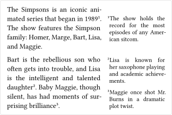

# marge

A package for easy-to-use but powerful and smart margin notes.

## Usage

This package provides a `sidenote` function that can be used to create margin notes. The function takes a single positional argument, the text of the note, and a number of optional keyword arguments that can be used to customize the appearance of the note:

| Parameter   | Description                                                           | Default               |
| ----------- | --------------------------------------------------------------------- | --------------------- |
| `side`      | The margin where the note should be placed.                           | `"outside"`           |
| `dy`        | The custom offset by which the note should be moved along the y-axis. | `0pt`                 |
| `padding`   | The space between the note and the page or content border.            | `2em`                 |
| `gap`       | The minimum gap between this and neighboring notes.                   | `0.4em`               |
| `numbering` | How the note should be numbered.                                      | `none`                |
| `counter`   | The counter to use for numbering.                                     | `counter("sidenote")` |
| `format`    | The "show rule" for the note.                                         | `it => it.default`    |

The parameters allow maximum flexibility and often allow values of different types:

- The `side` parameter can be set to `"inside"` or `"outside"` or any horizontal `alignment` value.
- If the `dy` parameter has a relative part, it is resolved relative to the height of the note.
- The `padding` parameter can be set either to a single length value, a tuple or left and right padding, or a dictionary. If a dictionary is used, the keys can be any value that is also accepted by the `side` parameter.
- With the `counter` parameter, you can for example combine the numbering of footnotes and sidenotes.

An especially useful feature is the `format` parameter, as it emulates the behavior of a show rule via a function. That function is called with the context of the note and receives a dictionary  with the following keys:

| Key         | Description                                              | Value or type               |
| ----------- | -------------------------------------------------------- | ----------------------------|
| `side`      | The side of the page the note is placed on.              | `left` or `right`           |
| `numbering` | The numbering of the note.                               | `str`, `function` or `none` |
| `counter`   | The counter used for numbering the note.                 | `counter`                   |
| `padding`   | The padding of the note, resolved to `left` and `right`. | `dictionary`                |
| `margin`    | The size of the margin, which the note is placed on.     | `length`                    |
| `source`    | The location in the document where the note is defined.  | `location`                  |
| `body`      | The content of the note.                                 | `str`                       |
| `default`   | The default look of the note.                            | `content`                   |

As the dictionary itself is not an element, you cannot directly use it within the `format` function as you would be able to in a normal show rule. To still be able to build upon the default look of the note without having to reconstruct it, the `default` key is provided.

Aside from the customizability, the package also provides automatic overlap and overflow protection. If a note would overlap with another note, it is moved further down the page, so that the `gap` parameters of both notes are respected. If a note would overflow the page, it is moved upwards, so that the bottom of the note is aligned with the bottom of the page content. Any previous notes, which would then overlap with the moved note, are also moved accordingly.

### Note about pages with automatic width

If a note is placed on the right margin of a page with width `auto`, further steps are required. As the final width of the page is not known when the note is placed, the note's position cannot be calculated. To still be able to place notes on the right margin of such pages, the package provides a `container` variable, which is supposed to be set as the page's background or foreground:

```typ
#import "@preview/marge:0.1.0": sidenote, container

#set page(width: auto, background: container)

...
```

The use of the `container` variable is detected automatically by the package, so that an error can be raised when it is required but not set.

## Example

```typ
#import "@preview/marge:0.1.0": sidenote

#set page(margin: (right: 5cm))
#set par(justify: true)

#let sidenote = sidenote.with(numbering: "1", padding: 1em)

The Simpsons is an iconic animated series that began in 1989
#sidenote[The show holds the record for the most episodes of any
American sitcom.]. The show features the Simpson family: Homer,
Marge, Bart, Lisa, and Maggie. 

Bart is the rebellious son who often gets into trouble, and Lisa
is the intelligent and talented daughter #sidenote[Lisa is known
for her saxophone playing and academic achievements.]. Baby
Maggie, though silent, has had moments of surprising brilliance
#sidenote[Maggie once shot Mr. Burns in a dramatic plot twist.].
```


